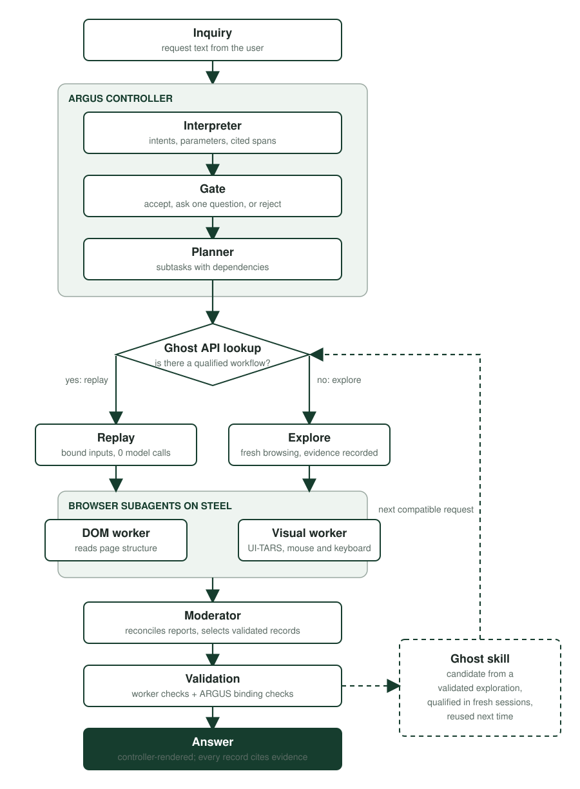

# ORION + Ghost API

Project for the Battle of the Schools Web Agents hackathon. ORION plans tasks, coordinates subagents and verifies their results. Ghost API turns successful browser interactions into reusable, parameterized capabilities. Browser subagents will use Steel.

**HTML-1: DOM browser worker implemented locally; shared integration pending.** The [browser worker](Agents/browser_worker/README.md) provides an async Python subagent with an optional FastAPI transport, Steel and GPT-5.4 adapters, and independent result verification. Ghost and visual modules also exist; see [CURRENT.md](docs/ai/CURRENT.md) for their separate evidence.

The [worker–Ghost connection](ghostapi/INTEGRATION.md) now implements DOM-first
execution, same-session UI-TARS fallback, candidate saving, explicit qualification and
semantic replay. The local Chrome/HTTP lifecycle is tested; live Steel/model and
ARGUS/moderator receiver verification remain pending.

## Run the demo

The recorded demo is ORION Mission Control on the **live runtime**: real public
websites visited in Steel browser sessions, fresh records each with its source URL and
observation, no model calls during a run. The three examples read staples.com,
en.wikivoyage.org and remotive.com. Full guide, expected results and failure modes:
[docs/hackathon/LIVE-DEMO.md](docs/hackathon/LIVE-DEMO.md).

From the repository root, with `STEEL_API_KEY` in `.env` and no live Steel session open
(the plan allows one):

1. Ghost registry for the demo, in its own database file:

```bash
GHOST_DATABASE_PATH=ghostapi/ghost-live.sqlite3 python -m uvicorn ghostapi.api.app:app --host 127.0.0.1 --port 8767
```

2. Register the three site workflows once (re-running changes nothing):

```bash
python ghostapi/demo/seed_live_workflows.py --url http://127.0.0.1:8767
```

3. Mission Control on the live runtime:

```bash
ARGUS_RUNTIME=scrape ARGUS_STORE=argus-runs/demo-live GHOST_API_URL=http://127.0.0.1:8767 GHOST_DATABASE_PATH=ghostapi/ghost-live.sqlite3 python -m uvicorn argus.api.app:create_app --factory --host 127.0.0.1 --port 4174
```

4. Open http://127.0.0.1:4174. The sidebar says **Live runtime** and the Ghost Library
   lists three qualified workflows. Run the Shopping, Travel and Jobs examples one at a
   time (about 15 to 25 seconds each). Results recorded on 2026-09-13:

| Example | Site | Result |
| --- | --- | --- |
| Shopping | staples.com | headphones 149.00 USD and keyboard 49.95 USD, cheapest within each limit |
| Travel | en.wikivoyage.org | six sourced stops over three days |
| Jobs | remotive.com | the listings showing a salary range, ranked by salary |

The connected runtime (ARGUS interpreter, DOM worker, Ghost and moderator on the
controlled catalog) is a separate script in
[docs/hackathon/DEMO-RUNBOOK.md](docs/hackathon/DEMO-RUNBOOK.md).

## How the system works

One request travels through ARGUS, Ghost, the browser subagents and the moderator
before the controller renders the answer. The ARGUS controller owns the run from
start to finish: its state, budgets, browser sessions, event stream and result. The
other components return decisions; the controller executes them and keeps every cap.

<p align="center"></p>

The stages, in the order the controller runs them:

| Stage | Who | What happens |
| --- | --- | --- |
| 1. Interpreting | ARGUS interpreter (`argus/interpreter.py`) | The request text becomes typed intents on a configured site or, for open-world requests, a target domain and goal. Every parameter is cited to the words it came from; nothing is invented. |
| 2. Gating | ARGUS gate (`argus/gate.py`) | Accepts the reading, asks one clarifying question when a required value is missing or too uncertain, or rejects requests for actions a read-only run never performs. |
| 3. Planning | ARGUS planner (`argus/planner.py`) | Splits the request into subtasks with dependencies and success conditions. Independent subtasks run concurrently; dependent ones wait for accepted reports and receive their inputs from them. |
| 4. Matching | Ghost API (`ghostapi/`) | Looks up a qualified workflow compatible with the subtask's site, operation and parameters. A match is replayed with strictly bound inputs and no model calls; otherwise the subtask explores. |
| 5. to 7. Dispatch, monitor, intake | Browser subagents (`Agents/browser_worker`, `Agents/visual`) | Each subtask runs in its own Steel session. The DOM worker reads page structure; the visual worker drives mouse and keyboard from screenshots when a page exposes no usable structure. Workers return records, actions and evidence, never a session. |
| 8. Reconciling | Moderator (`moderator/`) | Reads every accepted report, reorders, drops or supersedes records, and flags gaps and conflicts. It cannot add or alter a record: each one must equal a record a worker returned. |
| 9. Validating | Ghost bridge + worker verifier | The worker's own checks plus ARGUS binding checks: records are objects, present or an evidenced empty state, cite an observation from this run, and sit on the target domain. |
| 10. Synthesizing and publishing | Moderator selects, controller renders | The moderator selects validated records, their order and fields; the controller writes every user-facing line itself. A run never succeeds with a claim no record supports. |

After a validated exploration, Ghost compiles the trace into a candidate skill.
Qualification replays it in fresh sessions with changed inputs, including one case
that must return an evidenced empty result; only then is it reusable. A later
compatible request is served by replay and re-validated against the live page.

The recorded demo runs the same controller and stages on the live runtime, which
replaces the model interpreter and the workers with a fixed reader for three public
pages (see "Run the demo" above). The full pipeline with the model interpreter, DOM
worker, Ghost reuse and the moderator is the connected runtime in the
[runbook](docs/hackathon/DEMO-RUNBOOK.md); the intended design is in
[docs/ai/ARCHITECTURE.md](docs/ai/ARCHITECTURE.md).

## Run the browser worker

Follow [Agents/browser_worker/README.md](Agents/browser_worker/README.md) for setup, the no-key local demo, real GPT/Steel configuration, API requests, tests, and known limitations. The worker's versioned boundary is `SubtaskRequest` / `SubtaskReport` **0.2**; it does not replace the historical provisional ARGUS contract automatically.

## Start here

- [AI/project context](docs/ai/README.md): short reading guide for teammates and coding assistants.
- [Team tasks and project tracking](docs/ai/TEAM.md): Sting — Ghost API; Thomas — visual interpretation; Tianqi — HTML/code interpretation; Abel — ARGUS.
- [Architecture](docs/ai/ARCHITECTURE.md): request → subtasks → browser workers → moderator → final result, plus Ghost's lifecycle.
- [Ghost API module](ghostapi/README.md): workflow structure, development guide, interactive flowchart demo, tests, and Codecov setup.
- [Decisions](docs/ai/DECISIONS.md): confirmed choices and unresolved questions.
- [Research](docs/hackathon/RESEARCH.md): Steel, canvas, vision and the proposed feasibility experiment.
- [Provisional contract](docs/hackathon/CONTRACTS.md) and [evaluation checklist](docs/hackathon/EVALUATION.md): component examples and the evidence the MVP must produce.

## Coding-agent handoffs

Root [CLAUDE.md](CLAUDE.md) imports [AGENTS.md](AGENTS.md), which directs agents to the same project context. Start the coding tool from this repository and give it a scoped task. Other AI tools can start with `docs/ai/README.md`.

Each coding task should leave current module usage instructions, a concise change/test record in TEAM, and an explicit next handoff. Keep project-wide progress in CURRENT and decisions in DECISIONS. Teammates receive changes to these files when they pull the shared repository; updates are not synchronized between computers until published through Git.

## Scope

One read-only search/filter/extraction workflow, one public website and one controlled website with two UI versions. Demonstrate actual exploration, trace compilation, fresh qualification, changed-input reuse, independent validation and bounded repair with honest failure handling.

The [frontend](frontend/README.md), product-level [controlled site](demo-site/README.md) and [demo materials](docs/demo/README.md) directories still hold planning placeholders and need owners. The worker's small catalog under `Agents/browser_worker/demo/` is not the two-version product demonstration. The Ghost API module includes a standard-library fixture demo and interactive viewer; [the visual worker](Agents/visual/README.md) has its own evidence. Public-site choice and cross-component integration remain open. Python/FastAPI, Playwright/Steel and GPT-5.4 are local HTML-1 implementation choices, not a frozen project-wide stack; contract 0.2 awaits INT-1 agreement and receiver verification.
