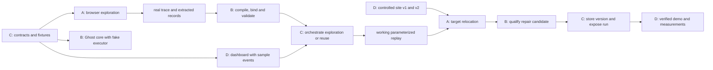

# Shared implementation plan

Owner: C. Contract baseline: 0.1. All assignments are provisional until names are entered.

## Outcome and scope

Demonstrate one real browser workflow being explored, compiled into a candidate skill, and reused with changed inputs to retrieve fresh results. Demonstrate one supported site-change repair on an explicitly labeled controlled website. Display evidence and measured behavior.

Default use case: search a product catalog by query and maximum price, return structured listings with source links. Support one public site selected after a short access test. Use one currency and a fixed output limit for the first implementation. Only add another filter after the main path works.

The controlled site must also have a skill learned through browser interaction. Do not imply a skill learned on the public site automatically transfers to it.

ARGUS interprets the request, chooses exploration or reuse, coordinates validation and bounded recovery, and presents the result. Ghost owns the reusable procedure and its lifecycle. No model training is required; learning means constructing, storing, testing, and reusing a procedure.

## Team ownership

| Role | Name | Owned implementation paths | Dependencies and shared-file rule |
| --- | --- | --- | --- |
| A | TBD | `backend/browser/`, `tests/browser/` | Implements C's shared types; gives B a real action trace |
| B | TBD | `backend/ghost/`, `tests/ghost/` | Uses A's execution interface and C's storage interface |
| C | TBD | `backend/argus/`, `backend/contracts/`, `backend/storage/`, `backend/api/`, `tests/integration/`, root setup/config | Owns backend dependencies, shared schemas, fixture messages, cross-component integration |
| D | TBD | `frontend/`, `demo-site/`, `docs/demo/` | Uses versioned API examples first; C wires integration with D through reviewed changes |

Proposed stack: Python backend and React/TypeScript frontend; use an existing browser-agent library with Steel. This is a planning default, not an installed dependency commitment. At kickoff, C and A confirm the team's familiar stack, starter access, and action-recording support. Then freeze the choice. C owns backend dependency files; D owns frontend dependency files; A/B request additions through C.

Each owner maintains their person document. C owns this plan and CONTRACTS.md; D owns EVALUATION.md. Proposed paths are created during implementation, not by this documentation pack.

## Dependencies and work that can start immediately

| Deliverable | Supplier → consumer | Needed by | Consumer can start with |
| --- | --- | --- | --- |
| Versioned request/result/event examples | C → A/B/D | Hour 1 | Contract in this pack |
| Browser action and observation interface | A + C → B | Hour 2 | A fake executor returning typed outcomes |
| Real successful trace and source evidence | A → B | Hour 4 | A small labeled sample trace; never count it as learned evidence |
| Run API and example event sequence | C → D | Hour 4 | D's local sample-event mode |
| Structured browser result | A → B/C | Hour 4 | Fixed sample listings with explicit fake-data labels |
| Compiler + skill matcher + checks | B → C | Hour 8–12 | In-memory registry and fake executor |
| Browser replay | A → B/C | Hour 8–12 | A deterministic local page |
| Controlled site with two UI versions | D → A/B | Hour 12 | Version 1 first; expose a simple change toggle |
| Live API connection | C + D → team | Hour 8 | Frontend API client kept separate from presentation components |
| Working demo and measurement evidence | All → D | Hour 20 | Draft script with placeholders, no invented measurements |

Critical sequence: contracts → real exploration and trace → validated candidate compilation → parameterized replay → requalification/repair → measured demo. Dashboard construction and controlled-site work run alongside this sequence.

## Schedule and gates

Times are elapsed working hours from the team's start, not a claim about the official submission deadline. C records the actual deadline and team cutoff at kickoff.

| Window | A | B | C | D | Gate |
| --- | --- | --- | --- | --- | --- |
| 0–1 | Test browser access and action capture | Review skill boundary and checks | Freeze scope, contracts, ownership | Sketch dashboard; define demo cases | One viable workflow and agreed messages |
| 1–4 | Explore once; save trace + results | Matcher/validator + sample compiler | API, run state, storage shell, fixture events | Form, event list, results using samples | Real trace available; interfaces callable |
| 4–8 | Stabilize extraction and step executor | Compile real trace; validate candidate | Connect exploration end to end | Connect API with C; honest empty/error states | One real request works in dashboard |
| 8–12 | Replay with changed inputs | Bind inputs; registry; replay checks | Route reuse and record measurements | Skill panel; controlled site v1/v2 | Fresh data from parameterized reuse |
| 12–16 | Relocate one changed control | Bounded repair + candidate version | Connect recovery; run comparison suite | Lead checklist; capture failures | Supported repair or honest fallback |
| 16–20 | Fix browser reliability | Fix incorrect acceptance/rejection | Freeze features; integrate and stabilize | Refine demo; record backup video | Reproducible demo and evidence |
| 20–24 | Support rehearsal | Verify technical claims | Final setup and submission readiness | Pitch, recording, submission materials | Deliverable ready before deadline |

Integrate at hours 4, 8, and 12. At each gate, C runs the smallest cross-component check and records the revision/result. A/B/D provide their own focused evidence; do not repeatedly rerun unrelated checks.

## Implementation sequence

1. C provides shared types, typed fake interfaces, and example messages. Establish a baseline commit before people create parallel branches when the team authorizes committing.
2. A proves exploration and action capture work together. A trace that only says “task succeeded” is insufficient for Ghost.
3. B creates checks from the accepted request/operation contract before compiling the trace. The compiler cannot weaken those checks to make its output pass.
4. C joins browser results, validation, events, and D's dashboard into one complete path.
5. A/B make replay independent of the exploratory agent's next-action loop. Resolve targets from the current page; never save temporary element IDs as permanent locators.
6. B validates changed inputs and fresh outputs. C records skill versions and measurements.
7. D supplies a controlled UI change. A proposes a replacement target; B validates a candidate repair; C publishes it only after qualification.

## Scope cuts

- Must have: one real exploration, actual trace compilation, parameterized reuse, final checks, source links, visible run state, honest measurements.
- Target: one supported UI repair and clearly handled unsupported change.
- Stretch only after hour-16 gates: second public site, concurrent workers, richer critic, optional extra filters.
- Defer: universal cross-site skills, large agent graphs, vector search, accounts, purchases/submissions, recurring monitoring, production hardening.

At hour 4, simplify or switch the workflow if action capture is failing. At hour 8, prioritize the complete exploration path over new features. At hour 12, if automatic compilation does not work, label any manually authored skill as such and reduce the claim. At hour 16, keep failure detection and exploration fallback if repair is unreliable.

## Collaboration rules

- Suggested branches: `feat/browser`, `feat/ghost`, `feat/argus`, `feat/experience`; names are proposals, not branches already created.
- Use separate working directories/worktrees for simultaneous implementation. No two people or AI sessions edit the same file concurrently.
- C coordinates shared-file changes and integration. Branch owners prepare changes; only the designated integrator performs shared integration operations for a checkpoint.
- Freeze contract 0.1 after kickoff. A breaking change requires C to update CONTRACTS.md, version the examples, notify affected owners, and track their migration before integration.
- Update logs with evidence, not percentages. “Replay passes changed-query test at revision X” is actionable; “90% done” is not.
- After 20 minutes blocked on another component, send its owner one concrete request and continue on the agreed fake interface.
- Keep credentials and raw authenticated browsing artifacts out of tracked files. Retain only the evidence needed for the demo.

## Decisions and current project status

| Decision | Current value | Owner / deadline |
| --- | --- | --- |
| Actual names A–D | Unassigned | Team / kickoff |
| Actual submission deadline | Not recorded | C / kickoff |
| Public website and allowed workflow | Not selected | A + team / hour 1 |
| Stack and dependency choices | Proposed above; not installed | C + A / hour 1 |
| Recording/execution adapter viability | Not tested | A / hour 2 |
| Currency, output limit, filter semantics | To freeze in operation contract | B + C / hour 1 |
| Git checkout and publication | Checkout restoration failed authentication; pack saved locally | C / before collaboration |

| Time | Decision/change | Reason | Affected owners | Evidence |
| --- | --- | --- | --- | --- |
| 2026-09-12 | Created documentation baseline | Organize four-person implementation | A/B/C/D | This pack; no implementation checks run |
