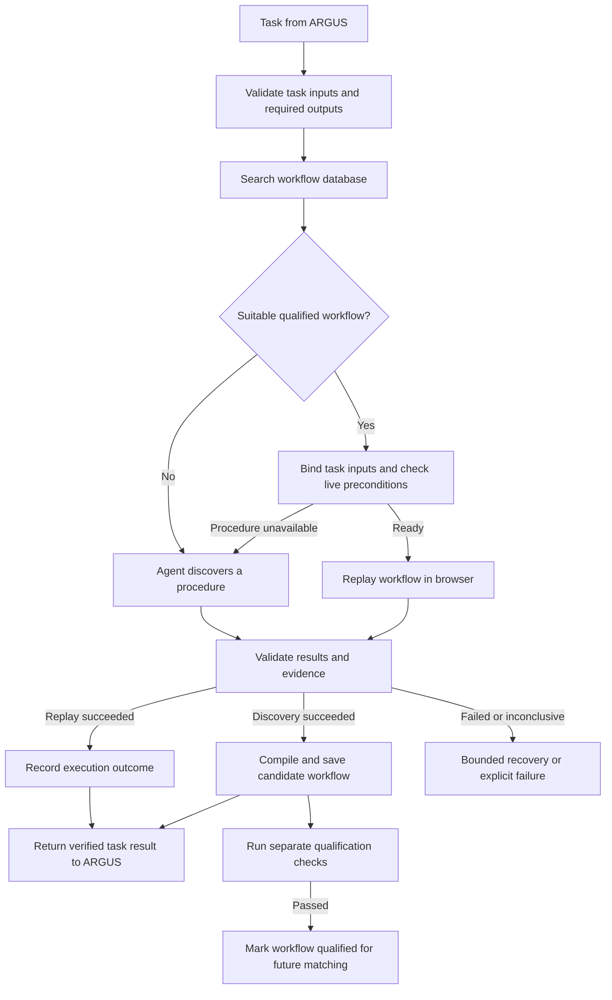

# Ghost API: workflow storage, matching, and creation

Status: proposed structure only; no implementation or database is created by this document.

Ghost API receives one task at a time from ARGUS. It looks in the database for a suitable reusable workflow. If one exists, the system runs it with the task's inputs. If none exists, an agent discovers a procedure, completes the task, and Ghost saves the successful procedure as a new workflow candidate.

This document calls a saved procedure a **workflow**. The existing [shared interface contract](../CONTRACTS.md) calls it a **skill**: `workflow_id` corresponds to `skill_id`. The existing API and field names remain unchanged; the structures below describe storage and internal behavior.

## 1. Main flow



Missing inputs and authentication requirements return an actionable error or handoff request; creating a workflow cannot resolve those prerequisites by itself.

## 2. What Ghost receives

ARGUS converts the user's goal into a structured task before requesting a workflow.

```json
{
  "schema_version": "0.1",
  "request_id": "task-123",
  "site_id": "demo-catalog",
  "operation": "search_products",
  "parameters": {
    "query": "headphones",
    "max_price": 150
  },
  "mode": "auto"
}
```

The configured operation defines required outputs, validation rules, currency, result limit, and allowed actions. `site_id` identifies a configured website. If a task spans several websites, ARGUS splits it into site-specific tasks before matching.

## 3. How workflows are saved

Use three logical database tables. The storage engine can be chosen during implementation; ordinary indexed queries are sufficient for the initial registry.

| Table | Purpose | Main fields |
| --- | --- | --- |
| `workflows` | Stable identity and searchable description | `skill_id`, `site_id`, `operation`, `description`, `tags`, `created_at` |
| `workflow_versions` | Versioned procedure and reuse eligibility | `skill_id`, `version`, `status`, `definition_json`, `source_run_ids`, `qualification`, `created_at` |
| `workflow_runs` | Individual execution history | `run_id`, `request_id`, nullable `skill_id` and `version`, `mode`, sanitized inputs, `status`, result reference, validation report, evidence references, metrics, error, timestamps |

Use `(skill_id, version)` as the unique version key. Index workflow lookup by `(site_id, operation)` and version filtering by status. A run references the exact version executed. Exploration runs can initially have no workflow reference; the resulting candidate records their run IDs.

`definition_json` contains the reusable procedure:

- Input schema and supported parameter scope.
- Preconditions, such as the expected form being available.
- Browser configuration without credentials or active session handles.
- Ordered steps, semantic targets, parameter bindings, and expected states.
- Output schema and independently defined validator references.
- Evidence requirements, permitted action scope, and recovery policy.

Store large traces and screenshots in artifact storage and keep their references in the database. Keep credentials, cookies, and temporary browser identifiers out of reusable definitions. Runtime session references belong to execution state.

Procedure definitions are immutable once saved. A repair creates another version; qualification and quarantine status can change with recorded evidence. Performance summaries are derived from run history so failed executions remain visible.

## 4. How to find the appropriate workflow

Matching has two steps: **filter for compatibility, then rank suitable candidates**.

First retrieve workflows for the task's exact configured site and operation. Keep only qualified versions that:

1. Accept all supplied parameters and their values.
2. Provide every required output.
3. Stay within the task's permitted action scope.
4. Have compatible declared preconditions and supported scope.

Rank surviving versions using validation recency and relevant execution history. Descriptions or semantic similarity may help rank compatible candidates later. Similar wording alone is insufficient: a hotel-search workflow cannot satisfy a flight-search task, and a workflow without a price filter cannot silently ignore `max_price`.

Check live preconditions after opening the execution session, before replay. Database metadata alone cannot establish that the current page is ready.

The match decision returns either:

```text
reuse: exact skill ID + version + selection reason
explore: reason no suitable qualified workflow was found
```

For the initial implementation, partial matches trigger full exploration. Do not combine several incomplete workflows automatically. Invalid task inputs are rejected before matching; a valid task unsupported by existing workflows proceeds to discovery.

## 5. How to use a saved workflow

1. Load and pin the selected version for this run.
2. Validate and bind the new input values.
3. Ask the browser layer to create a session and check live preconditions.
4. Replay the steps, checking expected page states as execution progresses.
5. Extract fresh structured results and evidence.
6. Validate the results against the task's success conditions.
7. Save the execution record and return its outcome to ARGUS.
8. Release the browser session when execution or any authorized handoff ends.

Parameter bindings refer to input names rather than copying values from the original discovery run:

```json
{
  "step_id": "set-query",
  "action": "fill",
  "target": {"role": "textbox", "label": "Search products"},
  "value": {"parameter": "query"},
  "expected_state": {"field_equals_parameter": "query"}
}
```

This step can fill `headphones` now and `keyboard` on a later run. Reuse runs the procedure again; it does not return old search results from the database.

## 6. How to create a workflow when none matches

1. Record the no-match reason, such as no workflow for this operation or no version supporting a requested filter.
2. ARGUS assigns discovery to a browser agent with the task, allowed actions, success conditions, and execution budget.
3. The agent performs the task while recording actions, observations, input origins, extraction steps, and evidence.
4. Validate the task result independently of the discovered procedure.
5. If validation passes, Ghost compiles the successful trace into a complete parameterized workflow. Remove exploratory detours only when the resulting procedure still passes replay checks.
6. Save the definition as a `candidate`, linked to the source execution. Reject incomplete traces or ambiguous parameter mappings rather than inventing missing steps.
7. Return the verified task result. Report candidate creation separately; compilation failure does not erase a successful task result.
8. Qualify the candidate in separate fresh-session replays before automatic reuse.

The current contract proposes two distinct changed input sets and one evidenced empty-result case for qualification. If required coverage is missing, the workflow remains a candidate.

```text
Successful discovery → candidate → qualification passes → qualified
Qualified version fails because its procedure broke → quarantined
Successful repair → new candidate version → qualification → qualified
```

A failed discovery saves a failed run and useful diagnostic evidence, not a reusable workflow. A genuinely new capability gets a new identity; a repair of the same procedure gets a new version. A no-match decision alone does not justify duplicating an existing identity.

## 7. Failure and recovery

Classify the failure before choosing a response. A timeout may allow a retry; a changed target may require repair; authentication requires a handoff. A failed replay does not automatically mean the whole workflow is invalid.

For the MVP, allow at most one repair attempt followed by at most one bounded exploration fallback when appropriate. Save a repair as a candidate version and qualify it before reuse. Quarantine a broken version when evidence supports that decision, preserving its history. If recovery fails, return the failure and evidence to ARGUS.

## 8. Component boundaries

| Component | Responsibility in this flow |
| --- | --- |
| ARGUS | Supplies tasks, coordinates execution and recovery, manages budgets and approvals, verifies the combined mission |
| Ghost | Matches, binds, compiles, validates workflow outcomes, qualifies, and versions reusable procedures |
| Storage layer | Persists workflow definitions, versions, execution records, and evidence references for Ghost |
| Browser agent and Steel adapter | Discover or execute browser steps, capture evidence, and manage browser sessions |

Ghost exposes the existing `match`, `bind`, `compile`, `validate`, `qualify`, and `propose_repair` functions. ARGUS remains the run controller. The existing `/api/runs` and `/api/skills` routes can expose this flow without adding another competing orchestration layer.

The first implementation needs structured lookup, strict input binding, browser discovery/replay, candidate storage, qualification, and execution history. Vector search and automatic workflow composition can wait until the registry requires them.
